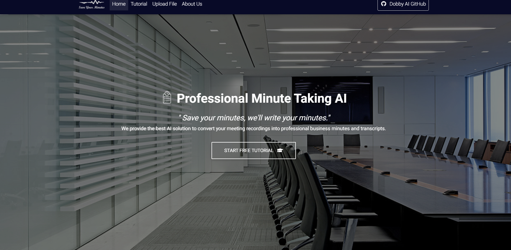

# :clipboard: Save Your Minutes

**`"Save your minutes, we'll write your minutes."`**   
*For 2021 KPMG Ideation Challenge*  

## Meeting Recordings into Professional Business Minutes
***Save Your Minutes*** provides the best AI solution to convert your meeting recordings into the professional business minutes and transcripts. Once you upload the audio file, you can get the professional minutes and speaker-diarized transcriptions immediately. With the ***Save Your Minutes***-made draft, you can easily add, rearrange and modify your minutes. And then? Everything is done!

## Purpose
*Dobby AI* came up with ***Save Your Minutes*** to help you become free from troublesome work of taking your minutes. Covid-19 has led to an increase in video conference, so it is time to leave the minutes to the AI. We also expect to provide value added services to the video conferencing platform.

## Features
#### :microphone: STT
Thanks to whatever API, we can take advantage of the most advanced speech-to-text technology.

#### :capital_abcd: NLP
Our intelligent natural language processing tools will help you implement your ideas easily.

#### :computer: SaaS
We deliver our service by a user-freindly website. You simply access it via the internet.

## How to use
### Requirements

### Basic usage

### Tutorial 

## About us, *Dobby-AI*

*Dobby-AI* is a project team for 2021 KPMG Ideation Challenge. May you be FREE!

## To be updated
